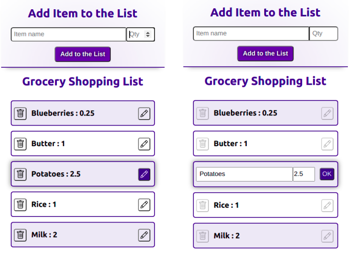

## Grocery Shopping List
### MERN stack project
***

### The task:
"Create a grocery shopping list. You can add items in the frontend. This data is stored in the backend. The list shows the items. You can create new items, you can delete items and you can modify items. So, if you want to change "tomaeteos" (misspelled) to "tomatoes", you can. All updated are stored in backend."
## Live Version is [= here =](https://grocery-shopping-list-creator.herokuapp.com/)

### Demo: 
***
